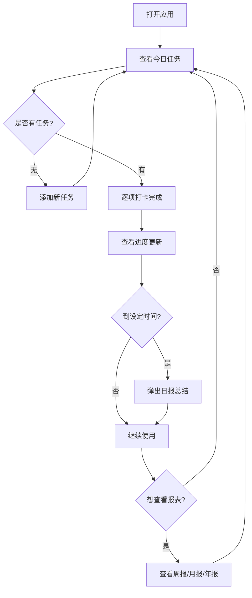

## 1. 产品概述

「小打卡」是一款可爱治愈风格的每日习惯打卡应用，帮助用户养成好习惯、完成短期和长期任务。纯前端实现，数据存储在浏览器本地，无需注册即可使用。

- 目标用户：希望养成好习惯、追踪每日进度的个人用户
- 核心价值：通过可爱治愈的视觉设计和打卡激励，让坚持变得有趣

## 2. 核心功能

### 2.1 功能模块

1. **首页仪表盘**：今日任务列表、整体完成进度、连续打卡天数
2. **任务管理**：添加/编辑/删除任务，设置短期或长期目标
3. **每日打卡**：勾选完成任务，查看当日进度
4. **日报推送**：每日定时生成完成情况总结
5. **可视化报表**：周报、月报、年报图表展示

### 2.2 页面详情

| 页面名称 | 模块名称 | 功能描述 |
|---------|---------|---------|
| 首页仪表盘 | 今日任务列表 | 展示当天所有待完成任务，支持一键打卡 |
| 首页仪表盘 | 进度概览 | 今日完成率环形图、连续打卡天数、总打卡次数 |
| 首页仪表盘 | 快捷操作 | 快速添加任务、查看历史 |
| 任务管理 | 任务列表 | 所有任务列表，区分短期/长期，支持编辑删除 |
| 任务管理 | 添加任务 | 表单：任务名称、类型（短期/长期）、目标描述 |
| 报表中心 | 周报 | 本周每日完成率柱状图、完成趋势 |
| 报表中心 | 月报 | 本月热力日历图、分类统计饼图 |
| 报表中心 | 年报 | 年度打卡总览、月度趋势折线图 |
| 日报弹窗 | 今日总结 | 自动生成完成情况、鼓励语、明日建议 |

## 3. 核心流程

用户打开应用 → 查看今日任务 → 逐个打卡 → 查看进度变化 → 每日定时收到日报总结 → 定期查看周报/月报/年报了解趋势

## 4. 用户界面设计

### 4.1 设计风格

- **主色调**：柔和的粉色系（#FFB5C2 为主色），辅以奶油黄（#FFF4E0）和薄荷绿（#B5EAD7）
- **背景**：温暖的奶油色渐变，带有微妙的圆点纹理
- **卡片**：大圆角（20px+），柔和阴影，半透明白色背景
- **按钮**：圆润大按钮，悬停有弹跳动画
- **字体**：圆体/可爱风格，中文使用系统默认圆体
- **图标**：Emoji 为主，搭配柔和色彩
- **氛围**：温暖、治愈、像在手帐本上打卡

### 4.2 页面设计概述

| 页面名称 | 模块名称 | UI 元素 |
|---------|---------|--------|
| 首页仪表盘 | 头部问候 | 根据时段显示不同问候语 + 可爱插图 emoji |
| 首页仪表盘 | 进度环形图 | SVG 环形进度条，带动画，中心显示百分比 |
| 首页仪表盘 | 任务卡片 | 白色圆角卡片，左侧 emoji 图标，右侧勾选框 |
| 首页仪表盘 | 连续打卡 | 显示火焰 emoji + 连续天数，底部导航栏 |
| 任务管理 | 任务卡片 | 与首页一致风格，增加编辑/删除按钮 |
| 任务管理 | 添加表单 | 底部弹窗，圆角输入框，可爱按钮 |
| 报表中心 | 图表区域 | 圆角卡片容器，使用 Chart.js 或自绘 SVG |
| 日报弹窗 | 弹窗 | 居中模态框，可爱插画，完成/未完成列表 |

### 4.3 响应式设计

- 桌面端：最大宽度 480px 居中显示，模拟手机卡片风格
- 移动端：全宽自适应，底部导航栏
- 触摸优化：打卡按钮足够大（44px+），方便手指点击

## 5. 数据存储

使用 localStorage 存储以下数据：
- 任务列表（id, name, type, createdAt, color/emoji）
- 打卡记录（taskId, date, completed）
- 用户设置（日报推送时间、昵称）