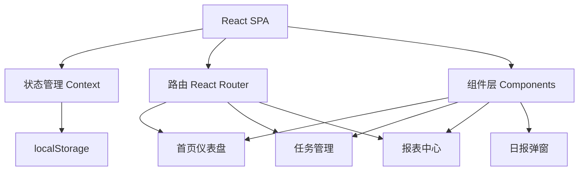

## 1. 架构设计

纯前端单页应用，数据存储在浏览器 localStorage，无需后端服务。



## 2. 技术选型

- **前端框架**：React 18 + TypeScript
- **构建工具**：Vite 5
- **样式方案**：CSS Modules + CSS 变量（自定义主题）
- **路由**：React Router v6
- **图表**：Recharts（轻量 React 图表库）
- **动画**：Framer Motion
- **数据持久化**：localStorage
- **定时通知**：Web Notification API + setInterval 定时检查
- **图标**：Emoji 为主，lucide-react 辅助

## 3. 路由定义

| 路由 | 页面 | 说明 |
|-----|------|------|
| / | 首页仪表盘 | 今日任务、进度概览、快捷操作 |
| /tasks | 任务管理 | 所有任务列表、添加编辑删除 |
| /reports | 报表中心 | 周报/月报/年报切换查看 |

## 4. 数据模型

### 4.1 任务（Task）

```typescript
interface Task {
  id: string;
  name: string;
  type: 'short' | 'long'; // 短期 / 长期
  emoji: string;           // 任务图标
  color: string;           // 任务主题色
  createdAt: string;       // ISO date
  order: number;           // 排序
}
```

### 4.2 打卡记录（CheckIn）

```typescript
interface CheckIn {
  taskId: string;
  date: string;       // YYYY-MM-DD
  completed: boolean;
  checkedAt: string;  // ISO datetime
}
```

### 4.3 用户设置（Settings）

```typescript
interface Settings {
  nickname: string;
  reportHour: number;   // 日报推送时间（小时，0-23）
  reportMinute: number; // 日报推送时间（分钟）
}
```

### 4.4 localStorage 结构

| Key | Value |
|-----|-------|
| `checkin_tasks` | Task[] |
| `checkin_records` | CheckIn[] |
| `checkin_settings` | Settings |

## 5. 组件树

```
App
├── Layout
│   ├── Header (问候语 + 日期)
│   ├── BottomNav (底部导航)
│   └── Outlet
├── Dashboard (首页)
│   ├── GreetingCard (时段问候)
│   ├── ProgressRing (完成率环形图)
│   ├── StreakBadge (连续打卡)
│   ├── TaskList (今日任务列表)
│   │   └── TaskItem (单个任务打卡)
│   └── QuickAdd (快速添加)
├── TasksPage (任务管理)
│   ├── TaskList (全部任务)
│   │   └── TaskItem (编辑/删除)
│   └── TaskForm (添加/编辑表单弹窗)
├── ReportsPage (报表)
│   ├── ReportTabs (周/月/年切换)
│   ├── WeeklyReport (周报柱状图)
│   ├── MonthlyReport (月报热力图)
│   └── YearlyReport (年报折线图)
└── DailyReport (日报弹窗)
    ├── CompletionSummary (完成总结)
    ├── Encouragement (鼓励语)
    └── MissedTasks (未完成任务)
```

## 6. 核心逻辑

### 6.1 日报定时推送

使用 `setInterval` 每分钟检查当前时间是否匹配用户设定的推送时间。匹配时通过 Web Notification API 发送浏览器通知，并弹出日报模态框。

### 6.2 连续打卡计算

遍历打卡记录，从今天往前数，找到第一个未完成所有任务的日子，计算连续天数。

### 6.3 报表数据聚合

从 localStorage 读取打卡记录，按日期聚合完成率，传递给 Recharts 图表组件渲染。